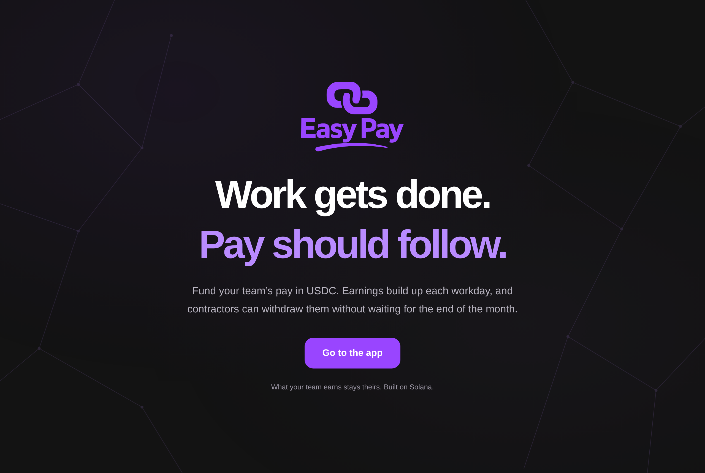
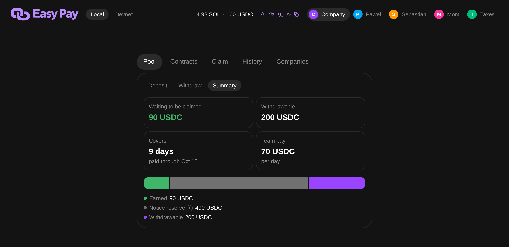
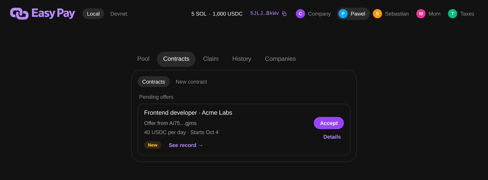
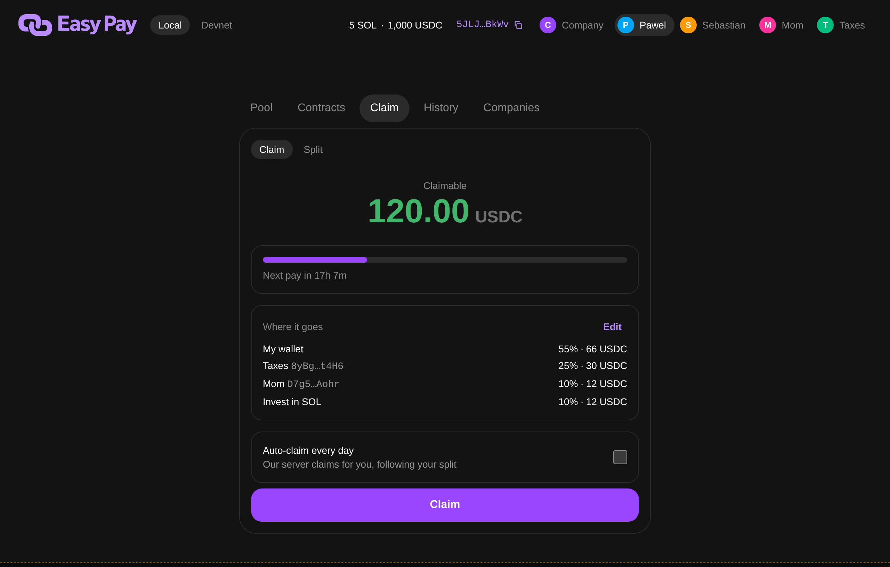
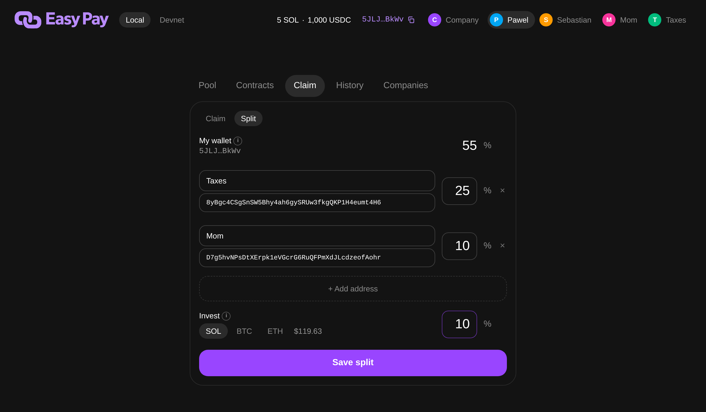
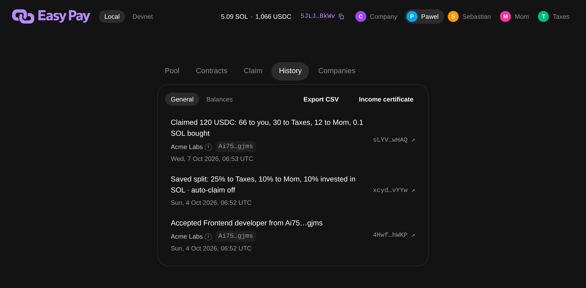
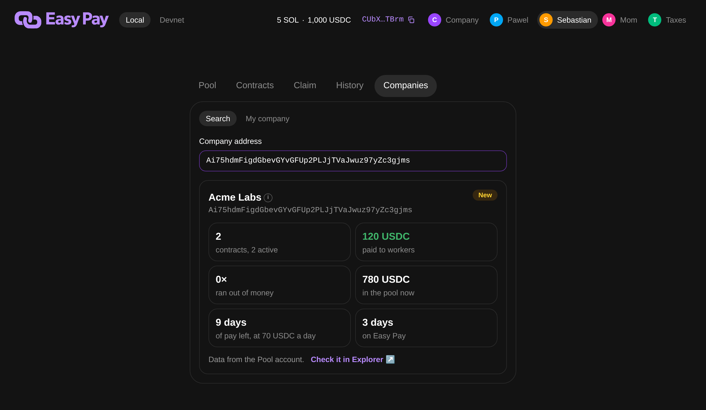

# Easy Pay

Daily pay for remote contractors, on Solana. The company puts USDC into one pool, the contractor earns their pay every day, and once a day is earned the company can't take it back, so nobody works a whole month on trust and then waits for the invoice to clear.

Try it on devnet: https://solana-easypay.vercel.app (Phantom in testnet mode, network Solana Devnet).



## Run it locally

You need Docker Desktop and VS Code with the Dev Containers extension, and everything else (Rust, Anchor, Solana CLI, Node, pnpm) lives in the container.

1. `git clone git@github.com:Pawel-Kica/solana-easypay.git && code solana-easypay`
2. Click **Reopen in Container** when VS Code asks. The first build takes a while, because the image is amd64 and runs under emulation on Apple Silicon.
3. In the VS Code terminal, run `pnpm dev` and wait until Vite prints its URL.
4. Open http://localhost:5173/app.

The app comes with test accounts (Company, Pawel, Sebastian, Mom, Taxes) that you switch in the top right, and a dev footer that moves chain time forward. If you want something to look at right away, click **seed demo** in the footer and in about half a minute you get companies with contracts and history.

## How it works

**The company funds a pool.** It creates a pool with its name and deposits USDC, and Summary shows what the team has earned, the notice reserve and what the company can still take back. Earned pay and the reserve are locked by the program, so Withdraw only ever gives back the rest.



**The contractor accepts an offer.** The company proposes a daily or hourly rate, a notice period and maybe a last day, and the contractor can open the company's record before signing. Accept only goes through if the pool already covers the notice period, and from that moment the terms can't change.



**Pay builds up every day.** From the start date the contractor earns their rate every day (or only on weekdays), and Claim sends it to their wallet whenever they like. With auto-claim on, our server claims for them every day, but it can only send the money where the contractor's split says.



**Split and invest.** Every claim can go out in parts, like 25% to a tax wallet and 10% to Mom, and a slice can be swapped into SOL, BTC or ETH at the Pyth price. Labels like "Mom" are stored on-chain encrypted, so only the contractor sees them.



**History and documents.** Every transaction opens in Solana Explorer, Balances shows the wallet in dollars, and the contractor can download an income certificate PDF for a bank or a landlord, plus a CSV for taxes with NBP exchange rates.



**Check a company before you start.** Companies shows any company's record straight from the chain: how many contracts it has, how much it paid, how often its pool ran dry and how long it has been around.



## Why

Our user is a remote B2B contractor working for a startup abroad, who already has Phantom and some SOL. Today they work a month on trust and wait 30 days or more for the money. A friend of ours did three months for a foreign startup, quit, and the founder refused to pay the last month, about $10k, and a court abroad would have cost more than that. The only fix today is someone in the middle you trust instead.

Easy Pay removes that someone, because the rules live in the program and not on our server:

- The intermediary disappears at accept (`programs/easypay/src/instructions/accept.rs:122`): the worker signs the exact terms, and the pool has to cover what is earned plus the notice period. From then on the company can withdraw at most the vault minus what workers earned and the notice reserve (`withdraw.rs:52`, `Pool::locked` in `state.rs:54`).
- Claim pays earned minus claimed (`claim.rs:106`), signed by the worker or a claimer the worker picked. If the pool runs short, `Pool::settle` (`state.rs:72`) splits it fairly up to a common hour.
- If the company disappears, the money sits in a vault owned by the pool PDA, so the worker still claims and can end the contract on their own.
- If the worker disappears, their earned pay stays reserved for them and the company withdraws only the rest.
- Deposit and withdraw are for the company only, accept for the side that didn't propose, claim for the worker or their claimer, and there are no admin keys or privileged instructions. The auto-claim server (`app/server/autoclaim.ts`) only signs claims the program would accept from the worker anyway.
- What we still control is the upgrade authority, one key of ours, so today we could ship new code. After the hackathon we plan a Squads multisig with a 7 day timelock, details in [docs/notatka_od_zespolu.md](docs/notatka_od_zespolu.md) (in Polish).

Why a blockchain and not a database: a database is run by someone, and that someone is the intermediary. Here neither side, and not us either, can move earned pay away from the worker.

## For developers and agents

```
programs/easypay/   Anchor program
app/                Vite + React + Tailwind web app
app/src/generated/  TS client, generated by Codama on every anchor build
app/tests/          program tests (LiteSVM), app unit tests, smoke test, README screenshots
app/scenarios/      Play mode, 24 scenarios that click the real app
txtx.yml, runbooks/ Surfpool deploy runbook
.devcontainer/      bootcamp devcontainer (Anchor 1.1.2, Rust 1.95, Node 24, Surfpool)
docs/specs/         specs and tickets
notes/              research, pitch, decisions (snapshot of the project notes)
```

Ports 8899, 8900, 5173 and 18488 have to be free. `pnpm dev` runs `anchor build`, then starts Surfpool (an offline local chain with the devnet USDC mint and Pyth price feeds from `scripts/chain-snapshot.json`), Vite and the auto-claim server side by side. While it runs, every `anchor build` redeploys the program and regenerates the TS client. Stop it with Ctrl+C.

- Surfpool Studio: http://localhost:18488
- Solana Explorer on the local chain: https://explorer.solana.com/?cluster=custom&customUrl=http://localhost:8899 (Chrome asks about local network access once, click Allow)
- Test accounts keep their keys in localStorage. Company, Pawel and Sebastian start with SOL and USDC, Mom and Taxes at 0 because they are split recipients.

A quick walk through by hand:

1. As Company, tab Pool: type a company name, Create pool, then Deposit, for example 200 USDC.
2. Switch to Pawel and copy its address (the purple address next to the account name).
3. Back to Company, tab Contracts, New contract, "I'm hiring": paste Pawel's address, 10 USDC per day, keep the 14 days notice, Propose.
4. Switch to Pawel, tab Contracts: Accept.
5. Click +1 day in the dev footer a few times.
6. Pawel, tab Claim: Claim, and the USDC lands in Pawel's balance.
7. Company, tab Pool, Withdraw: Max only gives back what nobody earned yet, minus the notice reserve (14 days of pay).
8. Company, tab Contracts, End contract: the earliest end is 14 days ahead, and pay keeps running until then.

Or let the app play it: `pnpm scenarios` in the Mac terminal (devcontainer running) opens a Chromium window with a Play panel. Pick one of 24 scenarios for the company or the worker, press Play and watch it click the real app with a short note before each step and a check after. Every Play starts on its own fresh chain (port 28899, app on http://localhost:25173/app), so your `pnpm dev` stays untouched. `pnpm scenarios --run all --headless` plays all of them without a window, about 25 minutes. The catalog is in `app/scenarios/catalog.mjs`.

The screenshots above come from `app/tests/readme-shots.mjs`, how to run it is at the top of that file.

The logo for slides is `app/public/brand/easy-pay.png` (transparent, 3200 px), with SVG, horizontal and favicon versions in the same folder. The original generated PNG and its prompt are in `assets/brand/`.

### Devnet

The Local / Devnet switch in the header reloads the app on the other network. Devnet uses Phantom (Settings, turn on testnet mode, pick Solana Devnet), SOL from https://faucet.solana.com and USDC from https://faucet.circle.com (network Solana Devnet). No test accounts and no dev footer there.

Deploy or upgrade the program on devnet, one person only, from the Mac terminal with the devcontainer running (or `pnpm deploy:devnet` inside it):

```
bash scripts/deploy-devnet.sh
```

It reads `DEPLOYER_KEYPAIR=[...]` (the deployer's keypair JSON) from the gitignored `.env` in the repo root, and makes one on the first run. That key pays and is the upgrade authority. First deploy: about 4.5 SOL (rent for the ~430 KB program plus a deploy buffer of the same size that is refunded). Upgrade: the refunded buffer plus rent for any growth. Plus a 0.5 SOL exchange reserve (`RESERVE_SOL`). The script prints its estimate. Not enough SOL: the script prints the address to fund and stops. The program ID is the same as Local.

### Test

```
pnpm test
```

Runs the program on LiteSVM (in-process, no validator, `pnpm dev` can keep running) and the app's unit tests, a few seconds. Run `anchor build` first after a program change. What to check per ticket and how to write a test: [docs/testing.md](docs/testing.md).

### Without VS Code (and for AI agents)

```
open -a Docker
npx @devcontainers/cli up --workspace-folder .
npx @devcontainers/cli exec --workspace-folder . pnpm dev
npx @devcontainers/cli exec --workspace-folder . pnpm test
```

Run every toolchain command through `devcontainer exec`. If the image pull fails with `docker-credential-desktop not found`, add `/Applications/Docker.app/Contents/Resources/bin` to `PATH`.

Notes for agents:

- Testing a change: read `docs/testing.md` first.
- Product context (what we build and why, decisions, competitors) is in `notes/AGENTS.md` and `notes/claude-memory/`. Solana docs for Kit, Anchor and Surfpool are in `.claude/skills/solana-dev/`.
- `pnpm dev` started in the foreground dies with your tool call. Use `bash scripts/chain.sh start --port N` instead (from the Mac or the container): it runs the same stack in the background on your own ports and returns once the app answers. Never restart the chain on 8899, someone may be clicking on it. Ports and the smoke test: `docs/testing.md`.
- Surfpool time travel: `surfnet_timeTravel` takes `absoluteTimestamp` in milliseconds. Read chain time from the Clock sysvar, not `Date.now()`.
- Playwright: Explorer reading localhost needs `context.grantPermissions(['local-network-access'], { origin: 'https://explorer.solana.com' })`. Toasts live 10 s.
